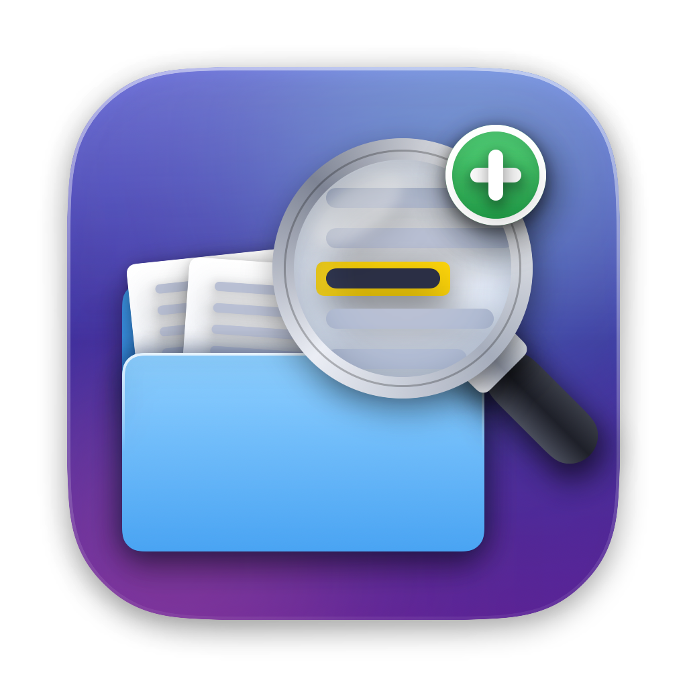
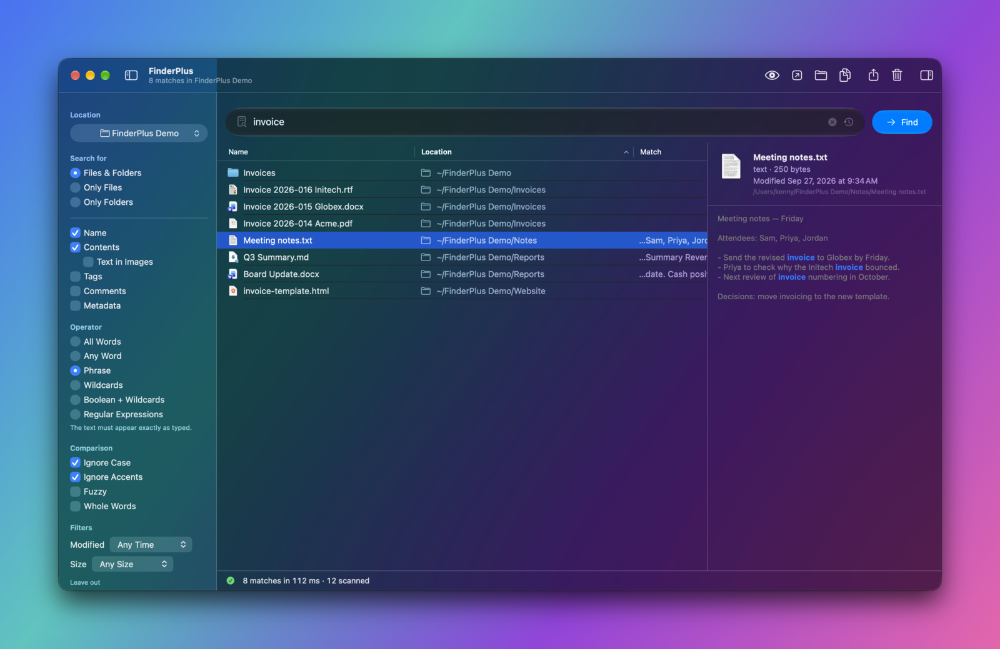

<p align="center">
  
</p>

# FinderPlus

A file search app for macOS with a Liquid Glass interface, inspired by
[EasyFind](https://www.devontechnologies.com/apps/freeware) from DEVONtechnologies. It searches the
disk **live, without Spotlight's index**, so it finds what Spotlight skips: hidden files, system
files, and anything that was never indexed. Runs on macOS 26 and later.

> [!NOTE]
> FinderPlus is at the very beginning of development. Features and behavior may change from one
> version to the next.

<p align="center">
  
</p>

## Features

### What to search

- File and folder **names**, file **contents**, Finder **tags**, Finder **comments** and
  **metadata** — any combination; an item matches when any ticked field does.
- Files and folders, only files, or only folders.
- Contents covers plain text and source code, PDF, RTF, Word, Excel, PowerPoint, OpenDocument
  (text, spreadsheets and presentations), EPUB books, and web pages without their markup. Files
  with unknown extensions are read if they look like text.
- **Text in images:** read the words in photos, screenshots and scanned PDFs, recognised on your
  Mac.
- **Metadata:** camera, lens, date taken and dimensions of photos; artist, album, title, genre and
  year of music; the owner and permissions of any file.
- **Inside zip archives:** list the files an archive holds, without unpacking it.

### How to match

- **All Words**, **Any Word**, **Phrase**, **Wildcards** (`*.pdf`, `IMG_????`),
  **Boolean + Wildcards** (`*.pdf OR *.docx NOT *draft*`, also `&`, `|`, `!`) and
  **Regular Expressions**.
- `"quoted phrases"` and `-excluded` words in the word modes.
- Ignore case, ignore accents (é = e), whole words only.
- **Fuzzy** matching that tolerates a typo in longer words, counting a swapped pair of letters as a
  single typo.

### Where to search

- A folder you choose (⌘L), or the folder shown in the **active Finder window**.
- **Search with FinderPlus** from any folder's right-click menu in Finder (under Services), or by
  dropping a folder on the FinderPlus Dock icon.
- **All volumes**, **local volumes**, **removable volumes**, a single drive, or iCloud Drive.
- Home, Desktop, Documents, Downloads and Applications, plus any folders you add — drop a folder
  on the options panel to add it.
- Choose whether to include package contents, invisible files, applications, and system folders
  such as `/System` and `/Library`.

### Narrow it down

- Modified today, in the past 7 or 30 days, or in the past year.
- Under 1 MB, or over 1 MB, 100 MB or 1 GB.
- Leave out images, video, audio or archives.
- Folders that are always skipped, such as `node_modules` or `.git`, set once in Settings.

### Results

- Results stream in while the search runs, already sorted; sort by name, location, kind, size,
  date modified or date created. The sort order is remembered.
- Each result shows its **location**; content and metadata searches show the matching text.
- A **preview** beside the results: the file's details, then either its text with every match
  marked or the usual Quick Look preview.
- Open, **Open With**, Show in Finder, Quick Look, Copy Path, Share and Move to Trash — from the
  toolbar, the context menu or the keyboard. Drag results into other apps.
- **Copy To** and **Move To** another folder, without overwriting anything already there.
- **Rename** the selected results in one go — find and replace, name-and-number, change case, or
  add the date — with every new name shown, and checked for collisions, before anything is touched.
- **Export** the results as a spreadsheet (CSV), or copy the selected rows as a table.
- **Find duplicates** among the results: files with identical contents, grouped into sets, with the
  space the extra copies take.
- A live count of matches and items scanned, and a shortcut to Full Disk Access when some folders
  couldn't be read.
- Recent searches, one click away in the search field.

### Interface

- Liquid Glass: a glass toolbar, search field and controls over one even, translucent window.
- **Several searches at once:** ⌘N opens another window, each with its own query, options and
  results; merge them into tabs from the Window menu if you prefer.
- Searches start only when you press **Find** — nothing runs while you type or change options.
- A new search in the same place narrows the results already on screen instead of blanking them.
- **Settings:** what double-clicking a result does, asking before moving to the Trash, recent
  searches, full paths, the largest file to read, a limit on matches, folders to always skip, and
  whether Full Disk Access is granted.
- **About FinderPlus** (in the app menu, and as a tab in Settings): the version, who made it, and a
  link to the project on GitHub.

### Shortcuts and Siri

- **Find Files** and **Find Duplicate Files** actions for the Shortcuts app: search a folder — or
  return a folder's extra copies, keeping the oldest of each set — and hand the files straight to
  the next action, no window needed.
- **Search in FinderPlus** opens the app with the search already running; "Search with FinderPlus"
  also works as a Siri phrase.

### Updates

- Updates itself from this repository's [GitHub Releases](https://github.com/kdbaustert/FinderPlus/releases):
  it checks once a day and asks before installing, or installs on its own if you choose that in
  Settings. **Check for Updates…** is in the app menu.
- **Stable and beta releases.** Everyone gets stable releases; turn on **Receive beta updates** in
  Settings to get betas as well, before they become stable.
- Every update is signed, and checked against that signature before it installs.

## Keyboard shortcuts

| Action | Shortcut |
| --- | --- |
| Focus the search field | ⌘F |
| Find | Return or ⌘↩ |
| Stop the search | ⌘. |
| Choose a folder to search | ⌘L |
| Show or hide the options panel | ⌃⌘S |
| Move from the search field into the results | ↓ |
| Open | ⌘O or double-click |
| Show in Finder | ⌘R |
| Quick Look | Space or ⌘Y |
| Copy path | ⌥⌘C |
| Move to Trash | ⌘⌫ |
| Show or hide the preview | ⌥⌘P |
| Export results | ⇧⌘E |
| Find duplicates in the results | ⇧⌘D |

## Permissions

FinderPlus needs no special permission to start. macOS asks for access the first time a search
reaches your Desktop, Documents or Downloads folder, or a removable or network volume. Searching
the **Active Finder Window** asks once for permission to control Finder.

To search everywhere — including other users' folders and protected system locations — grant
**Full Disk Access** in System Settings → Privacy & Security. When FinderPlus opens without it, it
explains what stays locked and takes you to that setting; Settings shows whether it is granted, and
the status bar counts the folders a search couldn't read.

## Privacy

No telemetry, analytics, crash reporting or account. The only network request FinderPlus makes on
its own is the daily update check, which fetches the release list from GitHub and sends nothing
about you or your Mac. Everything it reads stays on your Mac, including text recognised in images. Content searches and
duplicate checks skip iCloud files that aren't downloaded, so they never download your files.

## Building

```sh
./build.sh --install  # builds build/FinderPlus.app, copies it to /Applications and launches it
swift test            # the test suite
```

To publish a release, push a version tag. GitHub Actions builds, signs and publishes it, adds it to
the update feed, and records the version in `Resources/Info.plist` on `master`:

```sh
git tag v1.2.0 && git push origin v1.2.0            # a stable release
git tag v1.3.0-beta && git push origin v1.3.0-beta  # a beta, offered only to copies that opt in
```

The update feed is served by GitHub Pages from the `gh-pages` branch. To check a release before
tagging it, `VERSION=1.2.0 BUILD=40 ./release.sh [--beta]` builds the zip and the feed locally
without publishing anything. Releases are signed without an Apple Developer ID, so the first
download needs right-click → **Open**; updates after that install normally.

Building needs Xcode. To change the app icon, edit `Resources/Icon/make-icon.swift` and run
`swift Resources/Icon/make-icon.swift` from the repository root before building.

## Contributing

Issues and pull requests are welcome — for a bug, say what you searched for, where, and with which
options, since those decide what FinderPlus reads.

```sh
./build.sh --install  # builds build/FinderPlus.app, copies it to /Applications and launches it
swift test            # the test suite; CI runs it, and builds the app, on every push and pull request
```

Building needs Xcode and macOS 26. Keep to the style of the file you're changing, and add a test
for behaviour you add or fix — most of the search engine can be tested without a window. Releases
are made by maintainers, by pushing a version tag.

## License

FinderPlus is licensed under the [GNU General Public License v3.0](LICENSE).

Built by [@kdbaustert](https://github.com/kdbaustert).
